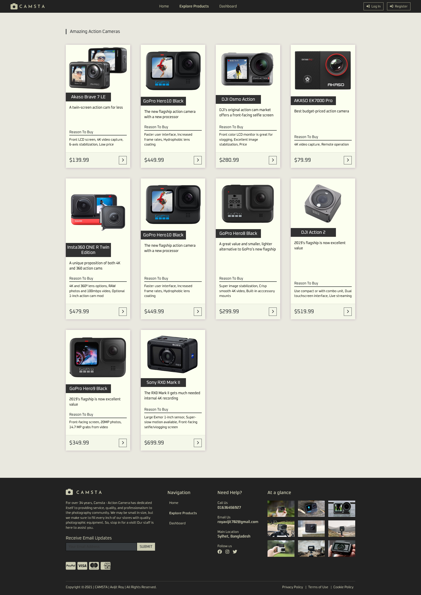
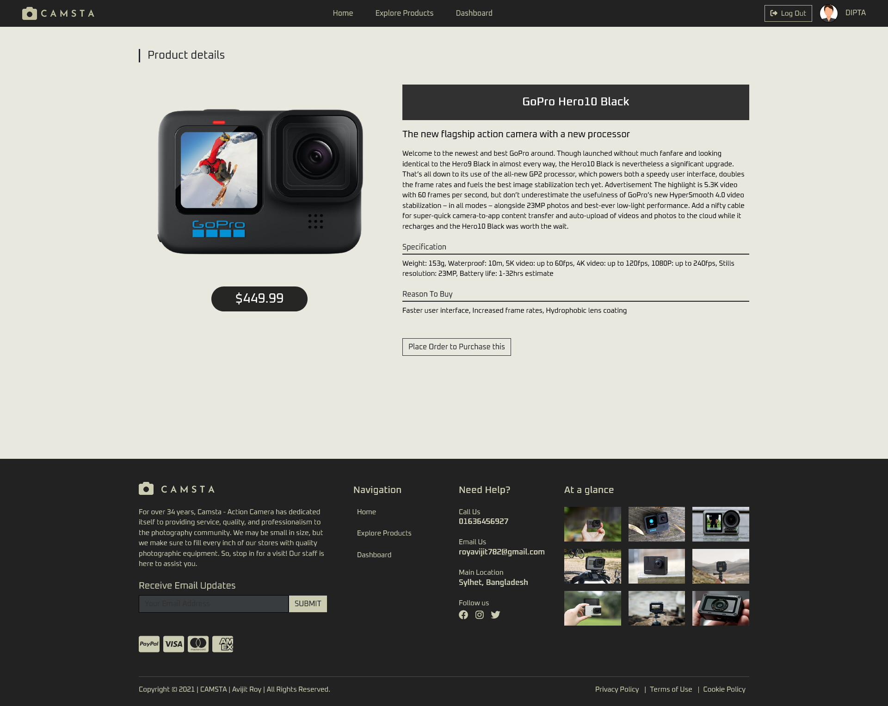
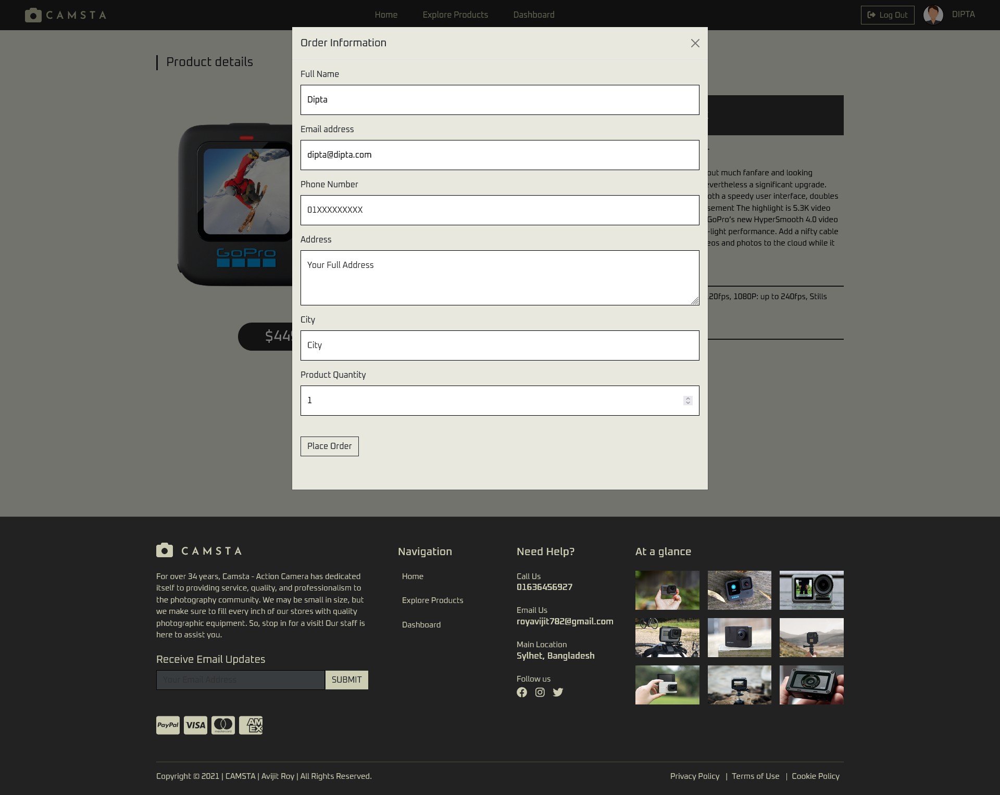
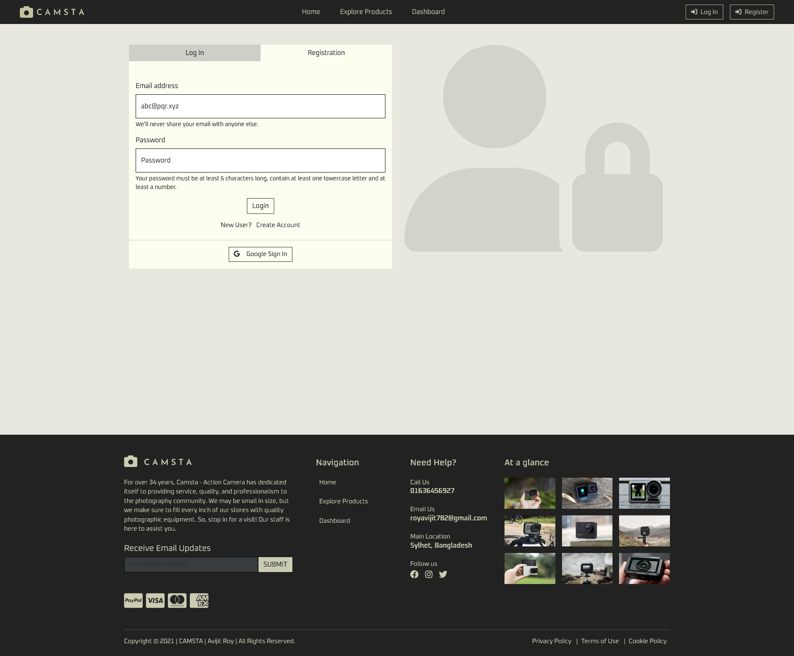
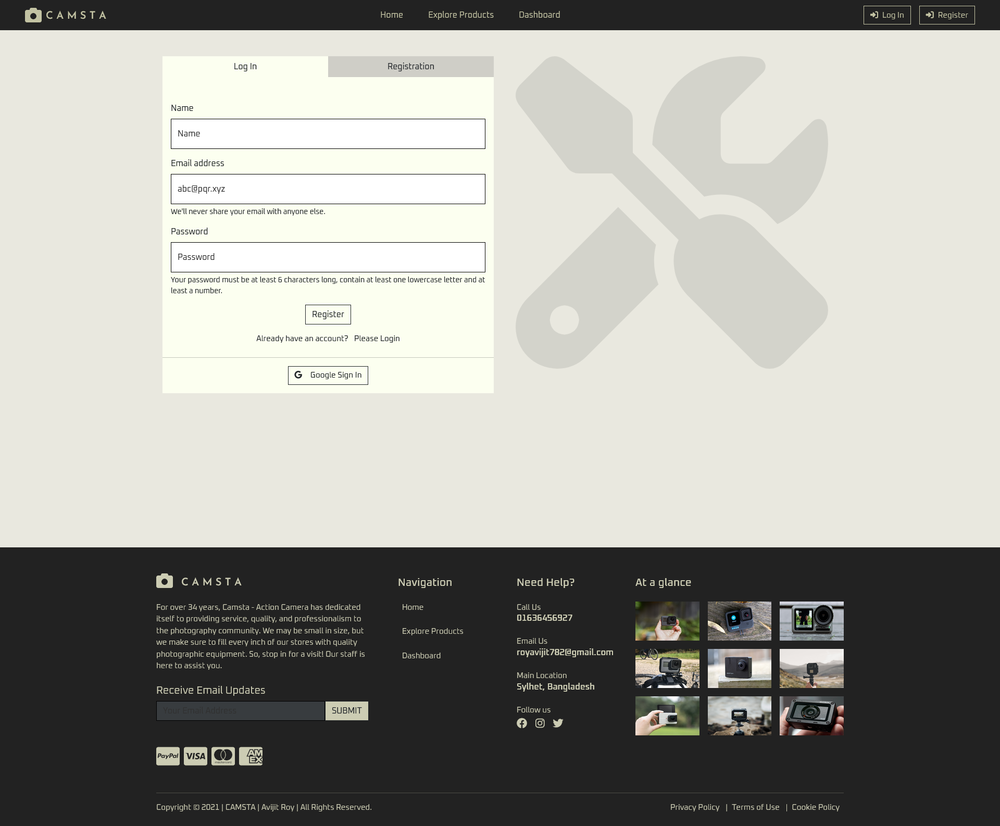
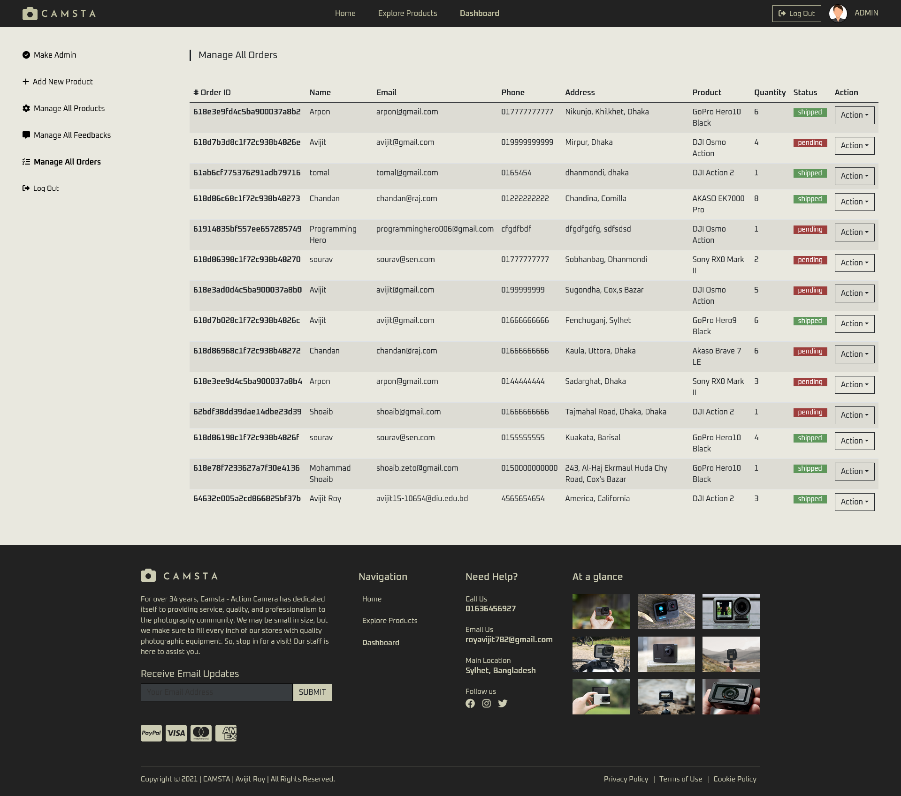
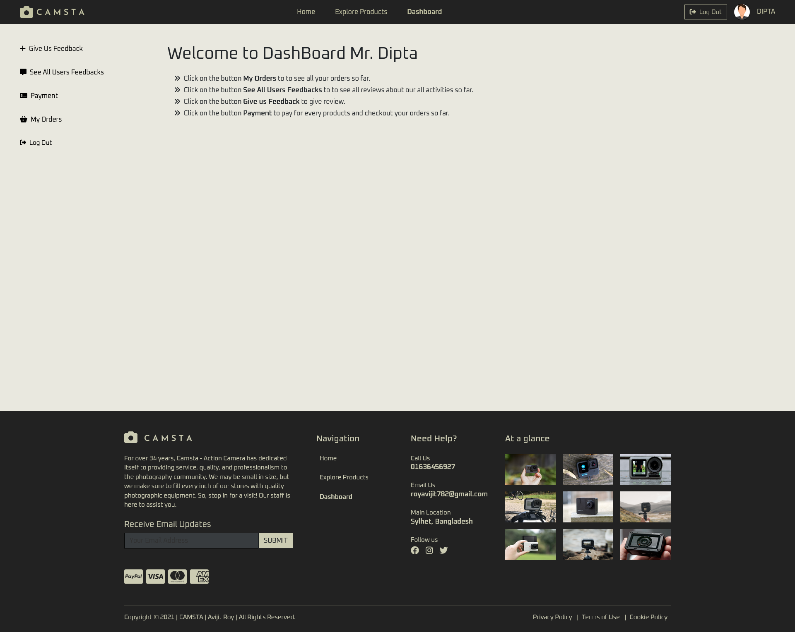
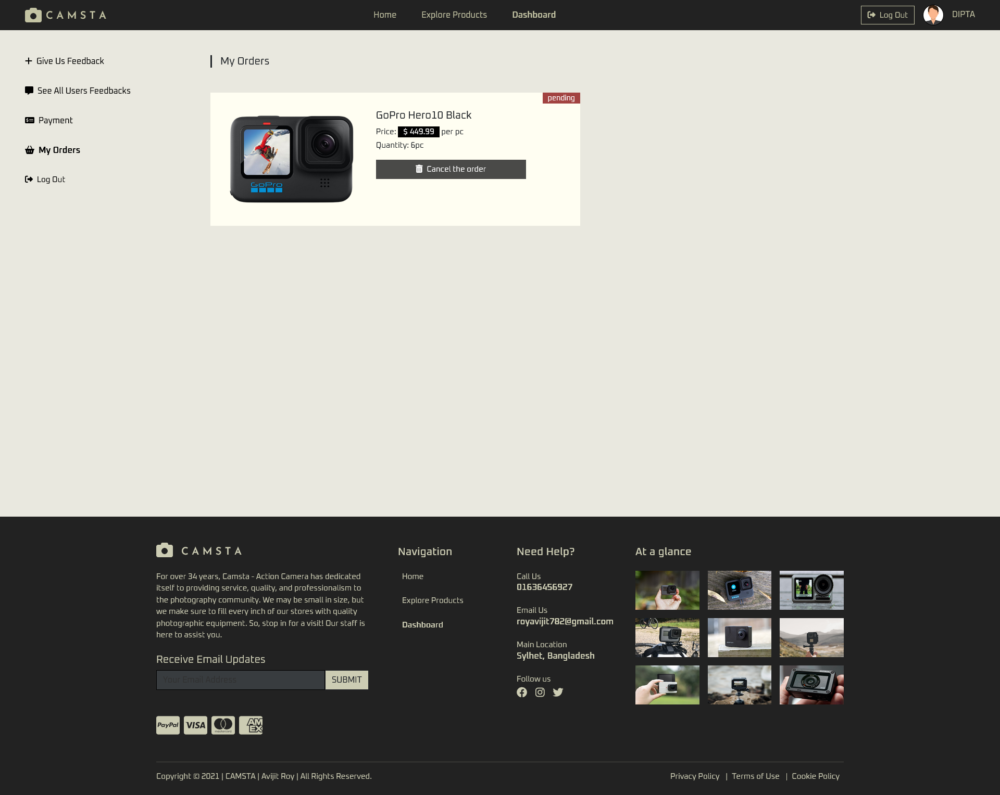
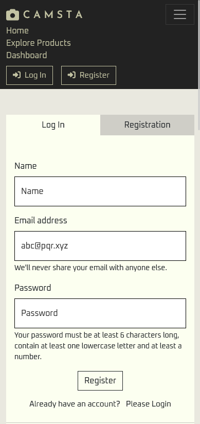
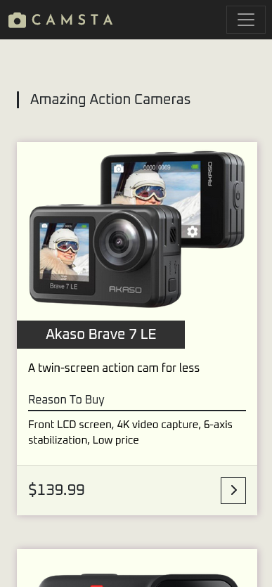

# Camsta -- a action camera shop

## Table of contents

- [Overview](#overview)
  - [Links](#links)
  - [The challenge](#the-challenge)
  - [Project features](#project-features)
  - [How to run](#how-to-run)
  - [Screenshot](#screenshot)
- [My process](#my-process)
  - [Built with](#built-with)
- [Author](#author)

## Overview

### Links

- Solution URL: [github link](https://github.com/ankan-782/Camsta-client-side)
- Live Site URL: [live site link](https://camsta-actioncam.web.app/)

### The challenge

Users should be able to:

- View the optimal layout for the site depending on their device's screen size
- See hover states for all interactive elements on the page
- use navigation for navigating through sections.
- use mobile menu for navigating sections in tablet and mobile devices.
- Receive an error message when the footer subscribe now `form` is submitted if:
  - The `input` field is empty
  - The email address is not formatted correctly

### Project features

- This is the action camera shop related website where customers can buy many action cameras through this website called Camsta.

- This website has basically 4 routes. Home, Explore Products, Dashboard and login-registration route. In Dashboard route there has many routes. But these routes can be available basically two kinds of users. For normal users of this website, My Orders, Payments, Give us Feedbacks, See all Feedbacks routes are available. For Admin user, Add a Product, Manage All Products, Manage All Feedbacks, Make Admin routes are available. There has a header for navigating Home, Explore Products, Dashboard, login and Registration and there has a footer in the last part of Home section.

- In home page there has 4 sections except header and footer which are banner section & some products, about us section and feedbacks section.

- Then, in products section all products will be available. Then products details will come when user clicks in the Button below. Then user see the details about the product and for purchasing that product user need to fill up the form.

- Then the purchase information is shown to the My orders section and Manage all orders section which is in the dashboard route.

- Admin can delete the orders from Manage All orders section and can approve the any user's orders by clicking the approve button. By approving the pending status will be cleared and set the status shipped from both section which are My orders section and Manage All orders. Lastly Admin can add a new product by going to the Dashboard > Add New product. Here Admin has to fill out the form for add a new product.

- Admin can make another user admin if the admin wants.

- Admin can delete feedbacks and products if he wants.

### How to run

- Clone the repository:

```bash
git clone https://github.com/ankan-782/Camsta-client-side.git
```

- Navigate to the project directory:

```bash
cd Camsta-client-side
```

- Install dependencies:

```bash
npm install
```

- run the project:

```bash
npm start
```

### Screenshot

- homepage at larger devices


- all products at larger devices



- products details at larger devices



- order information at larger devices



- login page at larger devices



- registration page at larger devices



- all orders list when user is admin



- add new product page when user is admin


- dashboard home page from normal user



- my order page when user is a normal user



- when navbar is opened at smaller devices



- another ss when device is smaller



## My process

### Built with

- React Js
- Semantic JSX markup
- Bootstrap css framework
- Flex-box
- CSS Grid
- Position
- Mobile-first workflow
- Firebase authentication
- API integration
- MongoDB database
- Various npm packages

## Author

- Website - [Avijit Roy](https://avijit-roy-portfolio.netlify.app/)
- LinkedIn - [avijit-roy-ankan](https://www.linkedin.com/in/avijit-roy-ankan/)
- Twitter - [@AvijitAnkan](https://twitter.com/AvijitAnkan)
